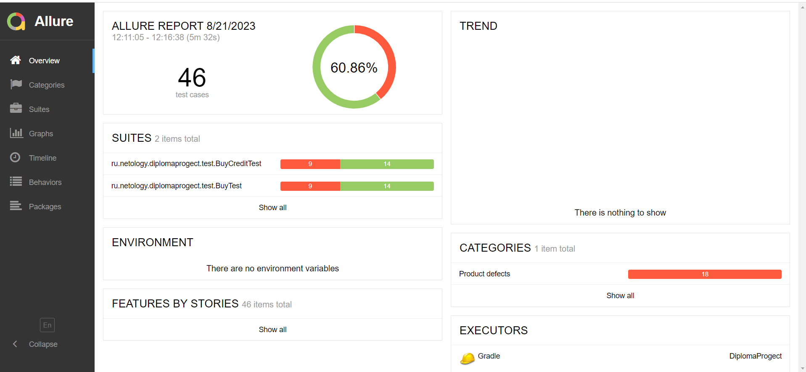
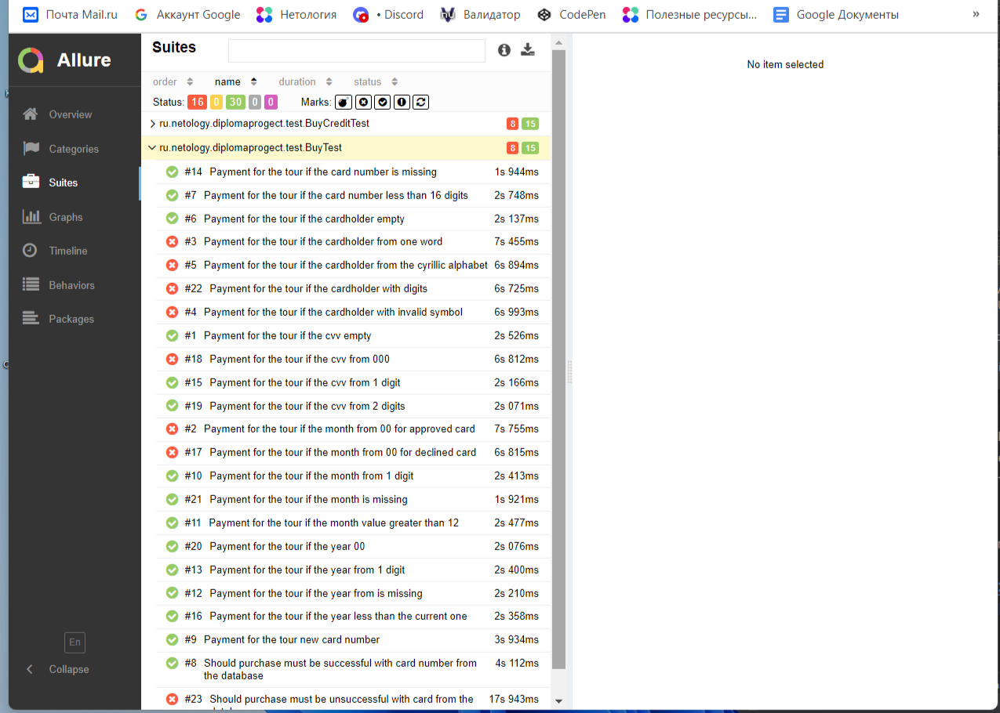

# Отчет о проведенном тестировании
## Краткое описание приложения
В качестве тестируемого приложения выступает веб-сервис, который предлагает купить тур по определённой цене двумя способами:
1. Обычная оплата по дебетовой карте. 
2. Уникальная технология - выдача кредита по данным банковской карты.
  Само приложение не обрабатывает данные по картам, а пересылает их банковским сервисам:
- сервису платежей, далее Payment Gate; 
- кредитному сервису, далее Credit Gate.
Приложение в собственной СУБД должно сохранять информацию о том, успешно ли был совершён платёж и каким способом. Данные карт при этом сохранять не допускается.
## Количетво тест-кейсов :
46
## Процент успешных тест-кейсов:
60.86%
## Процент не успешных тест-кейсов:
39.13%
## Общие рекомендации:
1. Устранить выявленные баги. 
2. Создать документацию с подробным описанием функциональности приложения и инструкциями по тестированию - это поможет облегчить работу тестировщиков и понять особенности работы приложения. 
3. Необходимо улучшить обработку ошибок и предоставление пользователю информативных сообщений о возникающих проблемах. Поскольку на разного рода ошибки высвечивается одно уведомление. Так пользователю будет проще верно заполнить форму. 
4. Кнопки "Купить" и "Купить в кредит" при нажатии должны изменять цвет, что подвержает работу выбранного сервиса; 
5. Страница веб-приложения имеет название "Заявка на карту", что не соответствует его работе.
## Файл отчета

